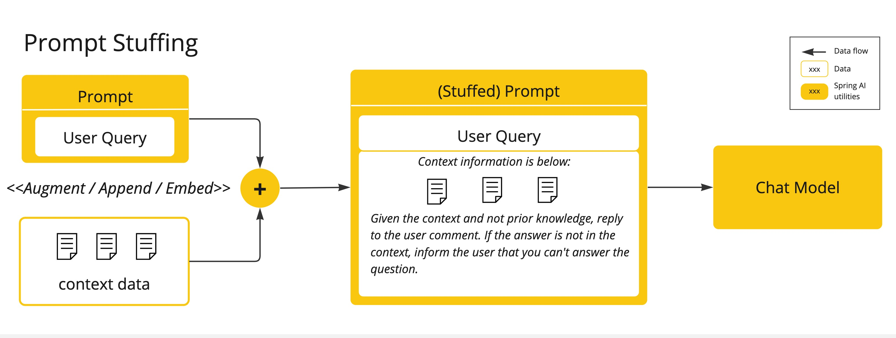

# 🌟 Spring AI - Prompt Stuffing Example

Welcome to the **Spring AI Prompt Stuffing Example**!

This project demonstrates how to **bring your own data** into Large Language Model (LLM) prompts using the **Prompt Stuffing** technique (also known as **Retrieval Augmented Generation – RAG**) with Spring AI.

---

## 📖 What is Prompt Stuffing?

**Prompt Stuffing** is a practical way to embed your **domain-specific data** directly into the prompt sent to an LLM.

Since LLMs have **token limits**, only a portion of your data can fit in the model’s context window. Prompt Stuffing helps you **inject relevant information** into the prompt so the model can answer using your own knowledge.

Spring AI simplifies this by providing an easy way to:

- Load **external context documents**
- Inject them into **prompt templates**
- Send enriched prompts to **OpenAI GPT models** (or other supported LLMs)

💡 In this project, we use **Olympic sports data** as a demonstration.

<p align="center">
  
</p>

## 💡 How Prompt Stuffing Works

1. Load the **context document** (`docs/olympic-sports.txt`)
2. Load the **prompt template** (`prompts/olympic-sports.st`)
3. Insert the **user question and optional context** into the template
4. Send the prompt to the LLM via **ChatClient**
5. Return the **AI-generated response**

> This allows you to **inject domain-specific knowledge** into any LLM request.

## 🛠️ Technologies Used

- **Java 21**
- **Spring Boot 4**
- **Spring AI ChatClient**
- **OpenAI GPT Models**
- **Prompt Templates & Context Files**
- **REST Controller** for demonstration

## 🔧 Why Use Prompt Stuffing?

- **Bring Your Own Data** – LLM can answer using your documents
- **Simple to implement** – inject a context string into the prompt
- **Flexible** – works with all LLMs supported by Spring AI
- **Foundation for RAG** – key technique in Retrieval Augmented Generation

## 📝 Example Request

Use the **`requests/olympics-request.http`** file to test endpoints directly from **IntelliJ** or **VS Code HTTP client**.

```http
GET http://localhost:8080/olympics/2024?stuffit=true
```

